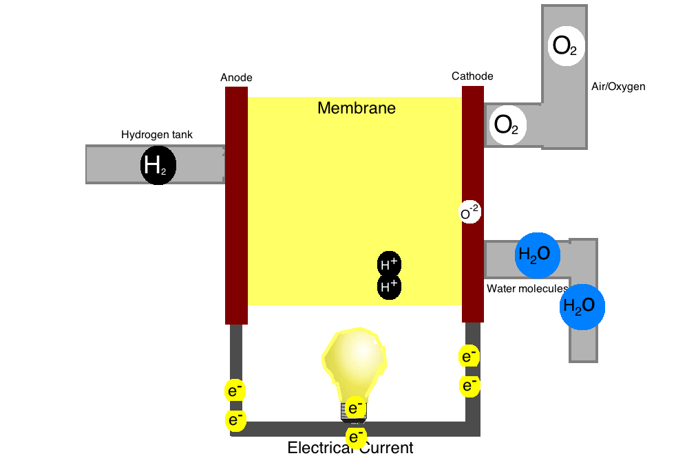

# PEM Fuel Cell Simulator

Polymer electrolyte membrane (PEM) fuel cell is a superconductivity for creating electrical energy. The device, which consists of layers, is used to convert chemical substance as fuel to electrical energy. The anode layer converts fuel into electrons that will be used for electrical current and hydrogen atoms that will transport to a second layer. The second layer is a cathode layer, it’s function mixes the hydrogen atoms from the anode and oxygen to create electrons and excess heat and water. Between the anode and cathode layer we have an electrolyte to transport leftover H+ from the anode to the cathode.  Here you will find its simulation.

### Commands

##### Running Locally

```
cd FuelCellSimulator
python3 -m simulator.py 
```

<p align="center">
    
</p>
